# Comparison of Vertex Componet Analysis (VCA) and Genetic Algorithm Endmember Extraction (GAEE) algorithms for Endmember Extraction

## Douglas Winston R. S., Gustavo T. Laureano, Celso G. Camilo Jr.

Endmember Extraction is a critical step in hyperspectral image analysis and classification. It is an useful method to decompose a mixed spectrum into a collection of spectra and their corresponding proportions. In this paper, we solve a linear endmember extraction problem as an evolutionary optimization task, maximizing the Simplex Volume in the endmember space. We propose a standard genetic algorithm and a variation with In Vitro Fertilization module (IVFm) to find the best solutions and compare the results with the state-of-art Vertex Component Analysis (VCA) method and the traditional algorithms Pixel Purity Index (PPI) and N-FINDR. The experimental results on real and synthetic hyperspectral data confirms the overcome in performance and accuracy of the proposed approaches over the mentioned algorithms.

**Envirionment Setup:**

Monte Carlo runs: 2 

Number of endmembers to estimate: 12 

Number of skewers (PPI): 1 

Maximum number of iterations (N-FINDR): 1 

### Parameters used in each GAEE versions

| Parameters            |   GAEE |   GAEE-IVFm |   GAEE-VCA |   GAEE-IVFm-VCA |
|:----------------------|-------:|------------:|-----------:|----------------:|
| Population Size       |   10   |        10   |       10   |            10   |
| Number of Generations |   10   |        10   |       10   |            10   |
| Crossover Probability |    1   |         1   |        1   |             1   |
| Mutation Probability  |    0.3 |         0.3 |        0.3 |             0.3 |

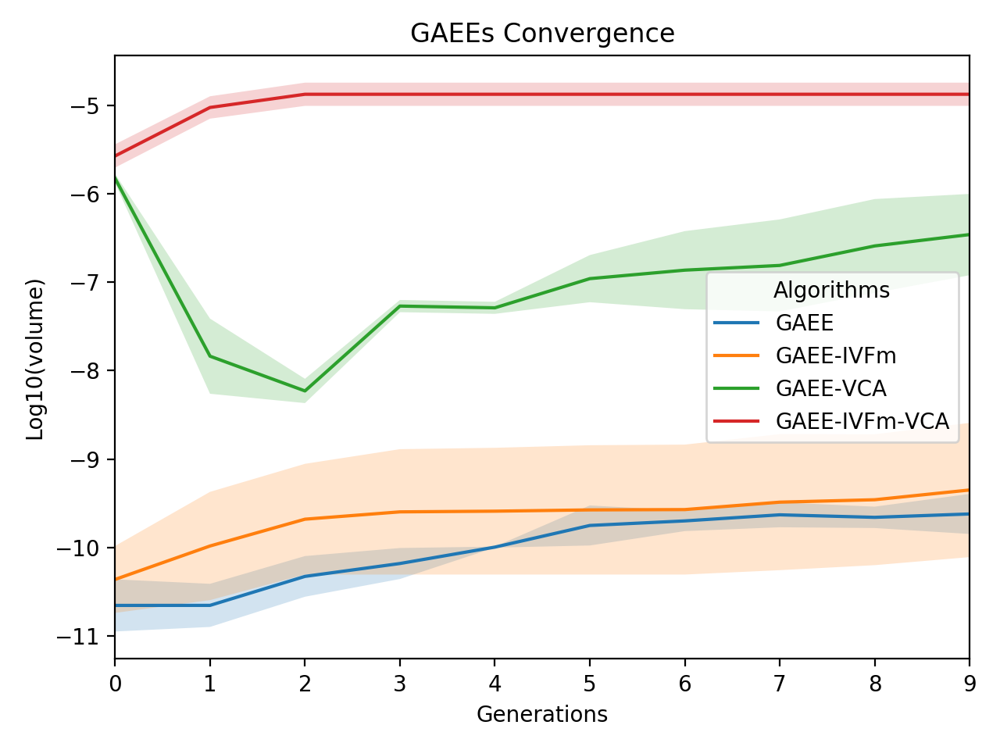

### Comparison between the ground-truth Laboratory Reflectances and extracted endmembers using PPI, N-FINDR, VCA, GAEE, GAEE-IVFm using SAM for the Cuprite Dataset.

| Endmembers       |    PPI |   NFINDR |    VCA |   GAEE |   GAEE-IVFm |   GAEE-VCA |   GAEE-IVFm-VCA |
|:-----------------|-------:|---------:|-------:|-------:|------------:|-----------:|----------------:|
| Alunite          | 0.3744 |   **0.0926** | 0.1016 | 0.1332 |      0.2669 |     0.1034 |          0.1034 |
| Andradite        | 0.0758 |   0.0725 | 0.0921 | 0.0911 |      **0.0637** |     0.0739 |          0.0815 |
| Buddingtonite    | 0.2081 |   **0.0762** | 0.0786 | 0.0950 |      0.1258 |     0.0897 |          0.0897 |
| Dumortierite     | 0.1907 |   0.0720 | **0.0708** | 0.0791 |      0.0813 |     0.0919 |          0.0919 |
| Kaolinite_1      | **0.0795** |   0.0870 | 0.0862 | 0.0886 |      0.1139 |     0.0870 |          0.0870 |
| Kaolinite_2      | 0.0820 |   0.0889 | 0.0797 | 0.0644 |      **0.0627** |     0.0668 |          0.0811 |
| Muscovite        | 0.2506 |   **0.1091** | 0.1205 | 0.1566 |      0.1689 |     0.1114 |          0.1114 |
| Montmonrillonite | 0.1338 |   0.0648 | **0.0643** | 0.0665 |      0.0698 |     0.0646 |          0.0646 |
| Nontronite       | 0.1033 |   **0.0758** | 0.1060 | 0.0776 |      0.0793 |     0.0804 |          0.0942 |
| Pyrope           | 0.0579 |   0.1222 | 0.2367 | 0.0613 |      0.0711 |     **0.0565** |          0.1902 |
| Sphene           | 0.0673 |   0.2857 | 0.0834 | 0.1928 |      0.1610 |     0.1443 |          **0.0627** |
| Chalcedony       | **0.0871** |   **0.0871** | 0.0878 | 0.1371 |      0.1092 |     **0.0871** |          **0.0871** |

### SAM Statistics for Cuprite Dataset. 

| Statistics   |      PPI |   NFINDR |    VCA |    GAEE |   GAEE-IVFm |   GAEE-VCA |   GAEE-IVFm-VCA |
|:-------------|---------:|---------:|-------:|--------:|------------:|-----------:|----------------:|
| _Mean_       |   0.1425 |   0.1059 | 0.1022 |  0.1067 |      0.1179 |     0.0987 |          **0.0982** |
| _Std_        |   **0.0000** |   0.0086 | 0.0030 |  0.0100 |      0.0147 |     0.0107 |          0.0152 |
| _p-value_    | -25.7788 |  **-1.0692** | 0.0000 | -1.2952 |     -4.1462 |     0.3285 |          1.2291 |
| Gain         |  31.0808 |   7.2730 | 3.8898 |  7.8910 |     16.6756 |     0.4602 |          **0.0000** |
| _Time_       |   0.3295 |   4.1457 | 0.7222 |  0.2550 |      0.2399 |     0.2391 |          **0.2237** |

### Comparison between the ground-truth Laboratory Reflectances and extracted endmembers using PPI, N-FINDR, VCA, GAEE, GAEE-IVFm using SID for the Cuprite Dataset.

| Endmembers       |    PPI |   NFINDR |    VCA |   GAEE |   GAEE-IVFm |   GAEE-VCA |   GAEE-IVFm-VCA |
|:-----------------|-------:|---------:|-------:|-------:|------------:|-----------:|----------------:|
| Alunite          | **0.0000** |   **0.0000** | 0.0133 | **0.0000** |      **0.0000** |     0.0137 |          0.0137 |
| Andradite        | **0.0000** |   0.0062 | 0.0080 | **0.0000** |      **0.0000** |     0.0099 |          0.0185 |
| Buddingtonite    | 0.0477 |   **0.0072** | 0.0077 | 0.0117 |      0.0163 |     0.0127 |          0.0097 |
| Dumortierite     | 0.0562 |   **0.0069** | 0.0072 | 0.0095 |      0.0113 |     0.0114 |          0.0114 |
| Kaolinite_1      | 0.0114 |   0.0131 | 0.0129 | 0.0170 |      0.0152 |     **0.0102** |          0.0114 |
| Kaolinite_2      | 0.0114 |   0.0109 | 0.0081 | **0.0057** |      0.0064 |     0.0058 |          0.0076 |
| Muscovite        | 0.0969 |   0.0317 | **0.0187** | 0.0297 |      0.0496 |     0.0189 |          0.0261 |
| Montmonrillonite | 0.0230 |   0.0049 | 0.0047 | 0.0049 |      **0.0046** |     0.0047 |          0.0047 |
| Nontronite       | 0.0126 |   0.0077 | 0.0133 | 0.0077 |      0.0085 |     0.0115 |          **0.0074** |
| Pyrope           | 0.0071 |   0.0531 | 0.0624 | 0.0063 |      **0.0061** |     0.0154 |          0.0083 |
| Sphene           | **0.0076** |   0.0912 | 0.0096 | 0.0529 |      0.0195 |     0.0529 |          0.0529 |
| Chalcedony       | **0.0088** |   **0.0088** | 0.0090 | 0.0257 |      0.0501 |     **0.0088** |          **0.0088** |

### SID Statistics for Cuprite Dataset. 

| Statistics   |     PPI |   NFINDR |    VCA |   GAEE |   GAEE-IVFm |   GAEE-VCA |   GAEE-IVFm-VCA |
|:-------------|--------:|---------:|-------:|-------:|------------:|-----------:|----------------:|
| _Mean_       |  0.0236 |   0.0227 | 0.0216 | **0.0153** |      0.0158 |     0.0195 |          0.0172 |
| _Std_        |  **0.0000** |   0.0033 | 0.0081 | 0.0014 |      0.0026 |     0.0068 |          0.0083 |
| _p-value_    | -0.2773 |  **-0.1422** | 0.0000 | 0.8854 |      0.8249 |     0.2519 |          0.6077 |
| Gain         | 31.0808 |   7.2730 | 3.8898 | 7.8910 |     16.6756 |     0.4602 |          **0.0000** |
| _Time_       |  0.3295 |   4.1457 | 0.7222 | 0.2550 |      0.2399 |     0.2391 |          **0.2237** |

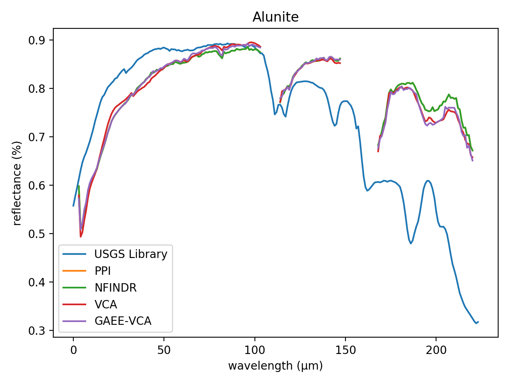

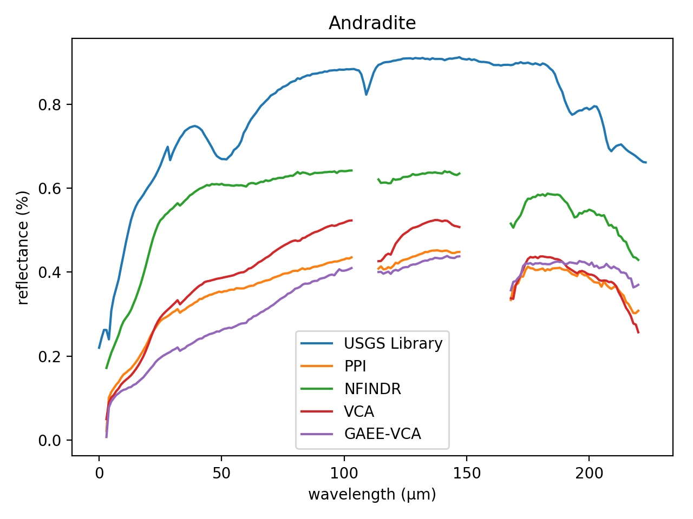

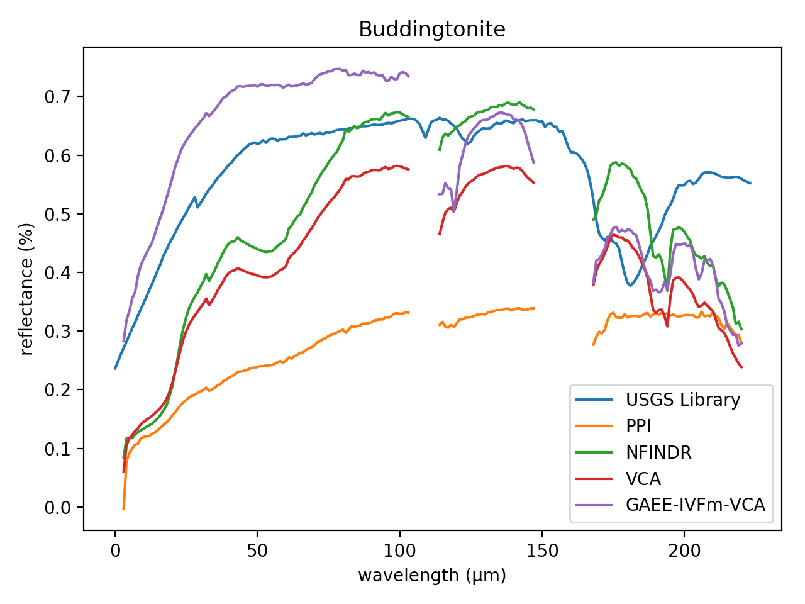

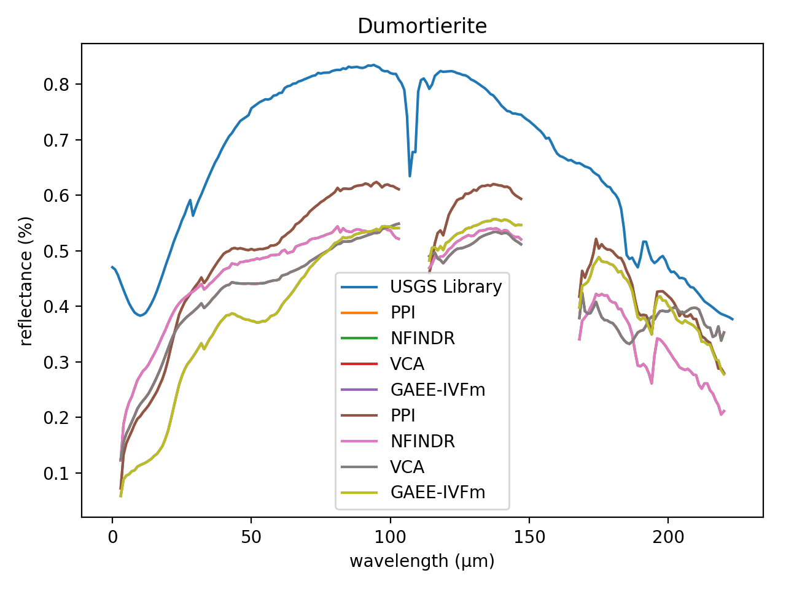

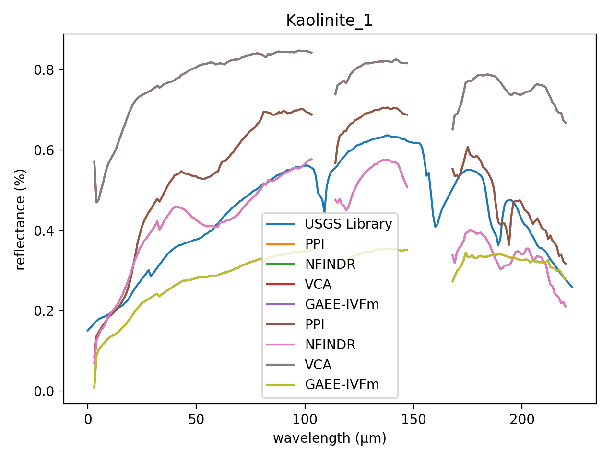

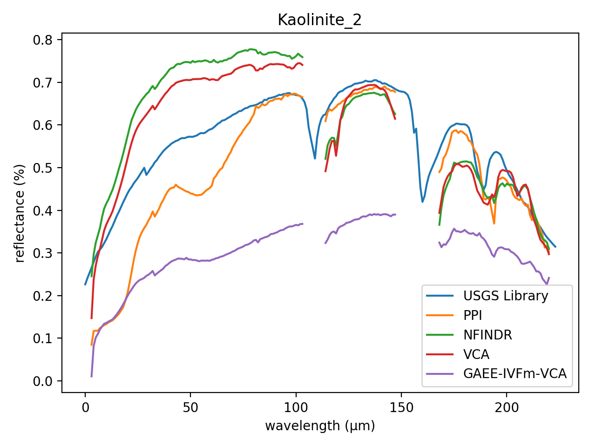

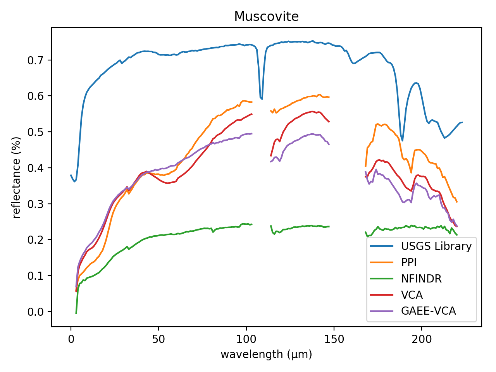

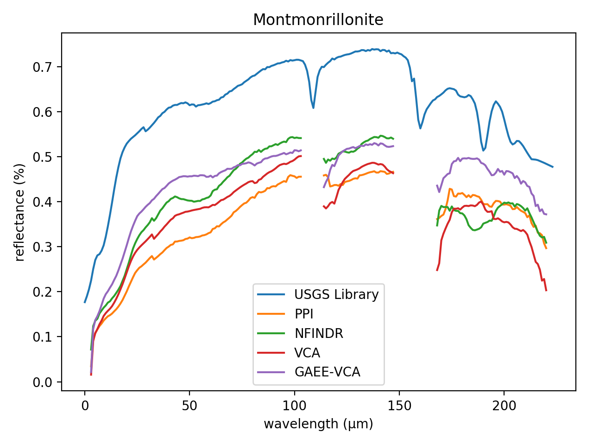

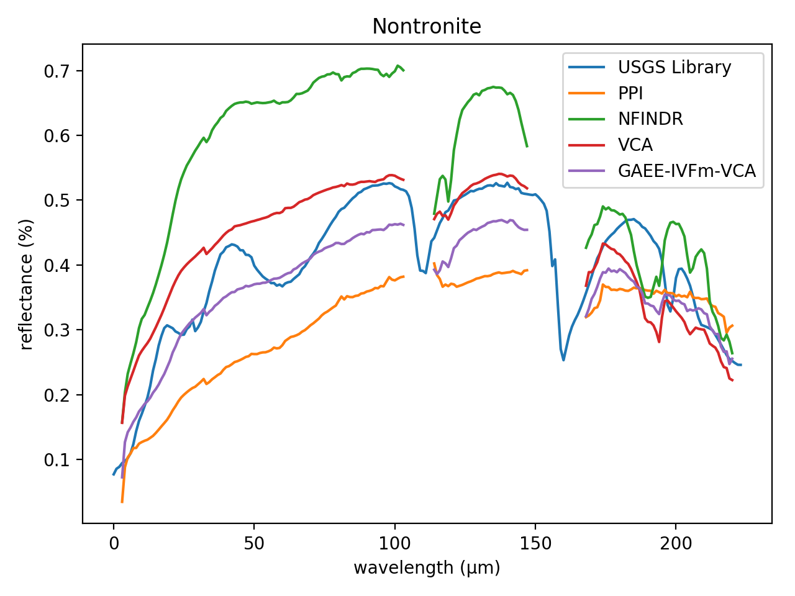

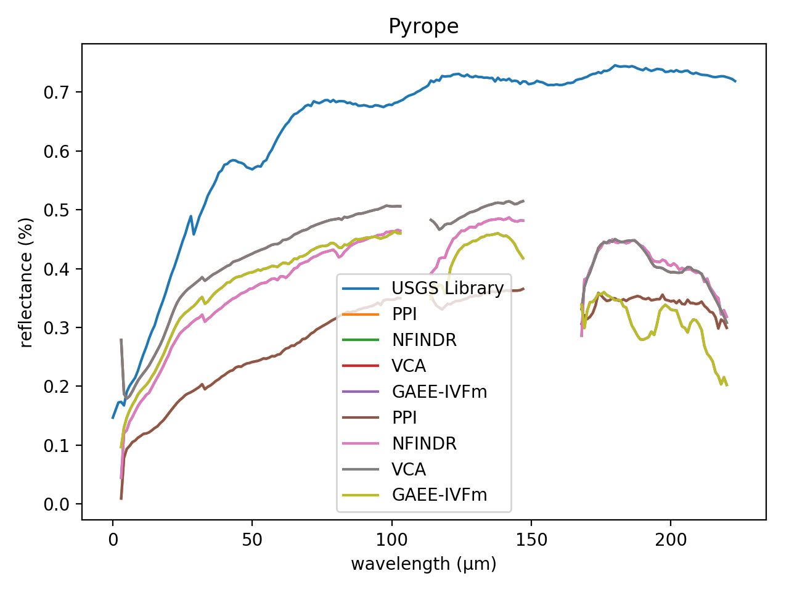

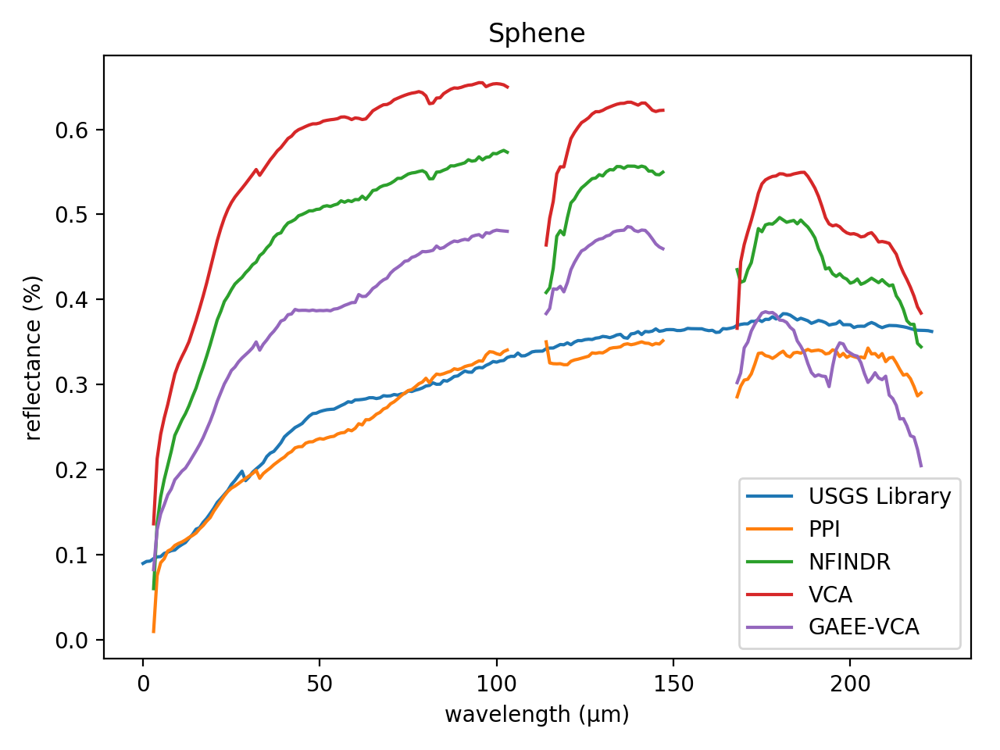

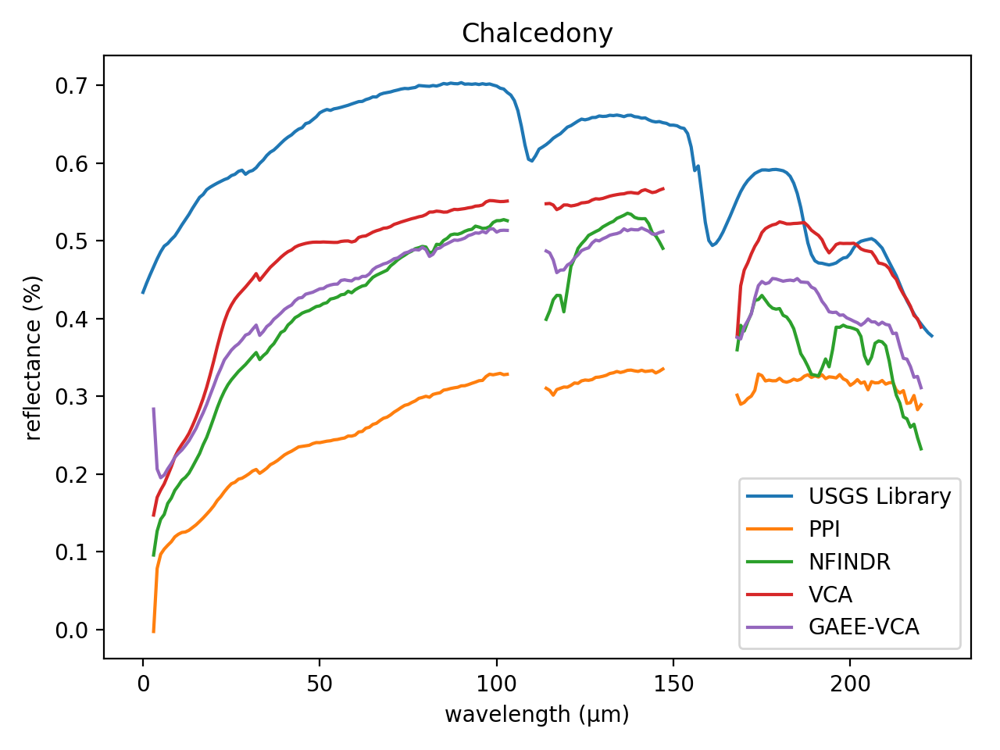

