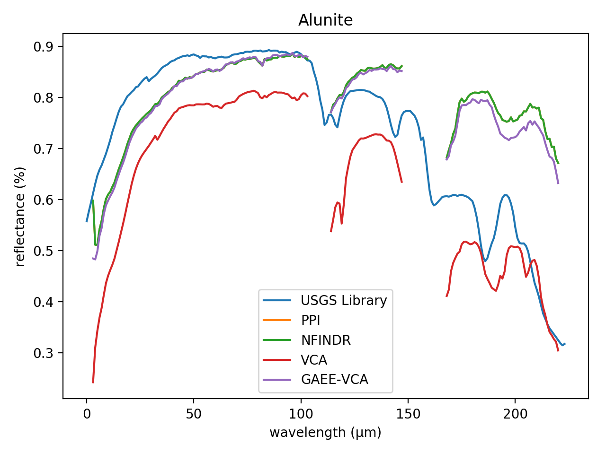
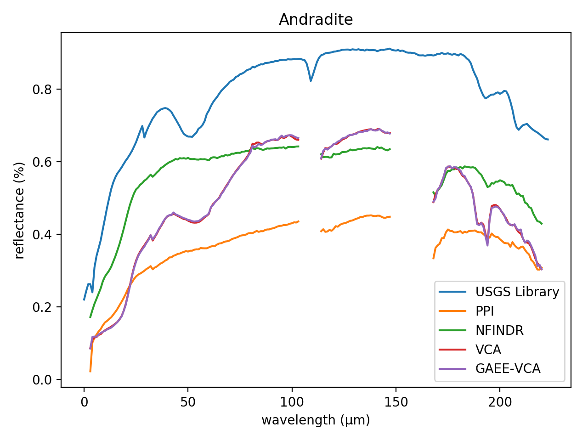
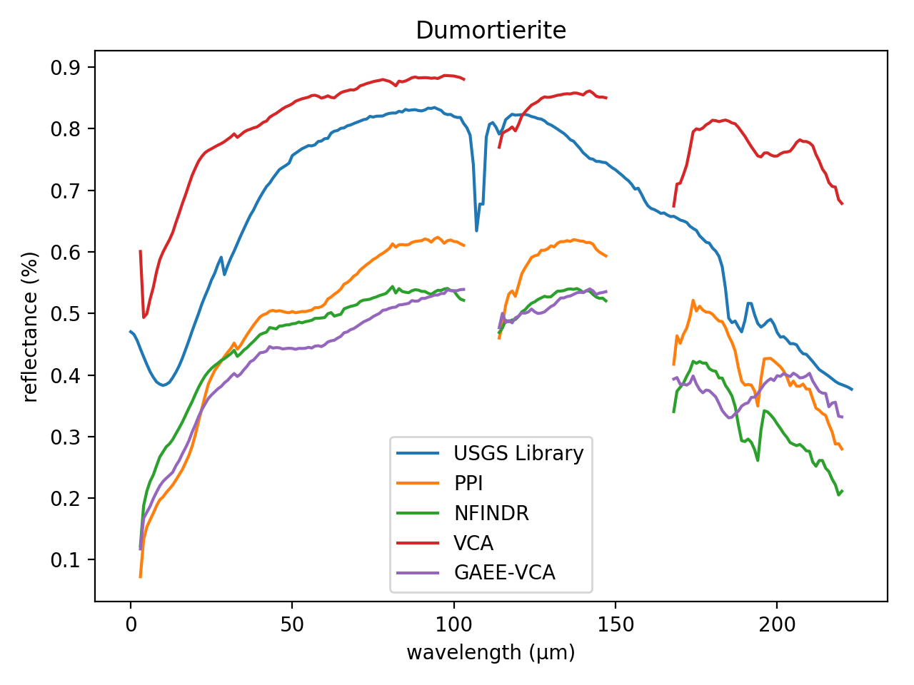
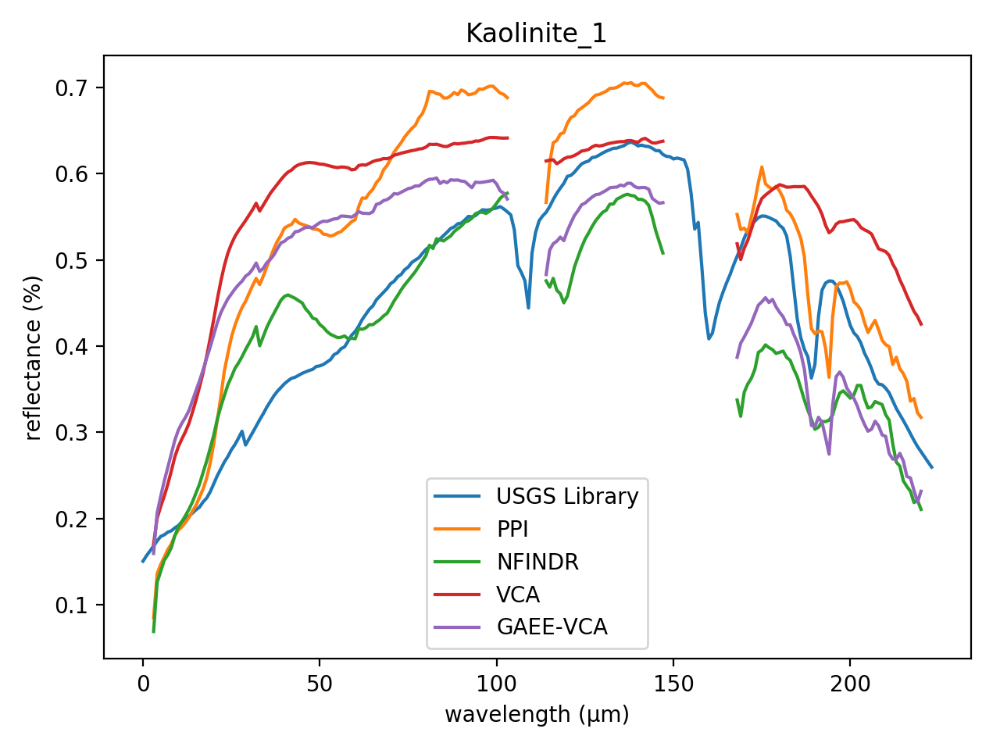
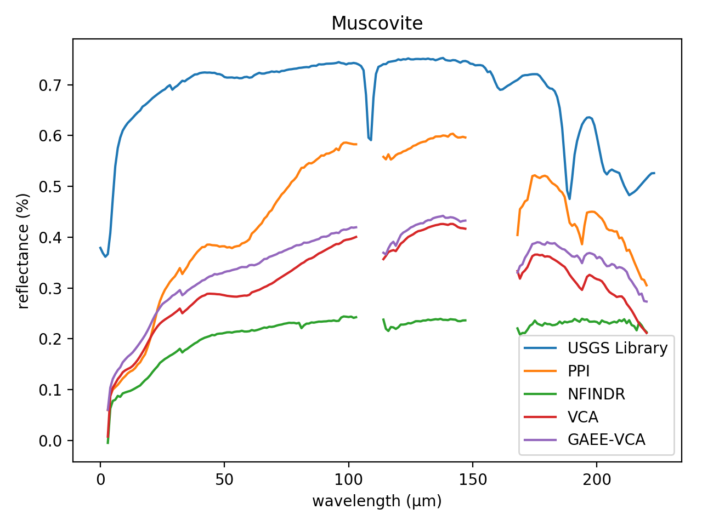
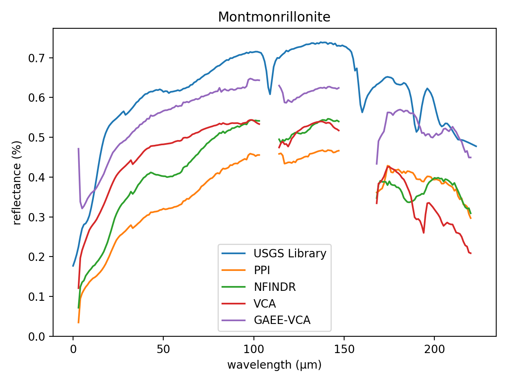
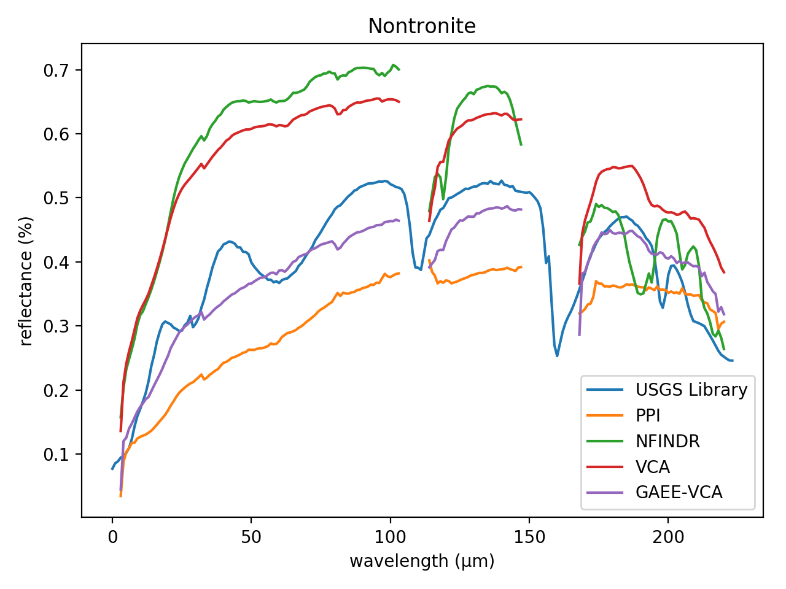
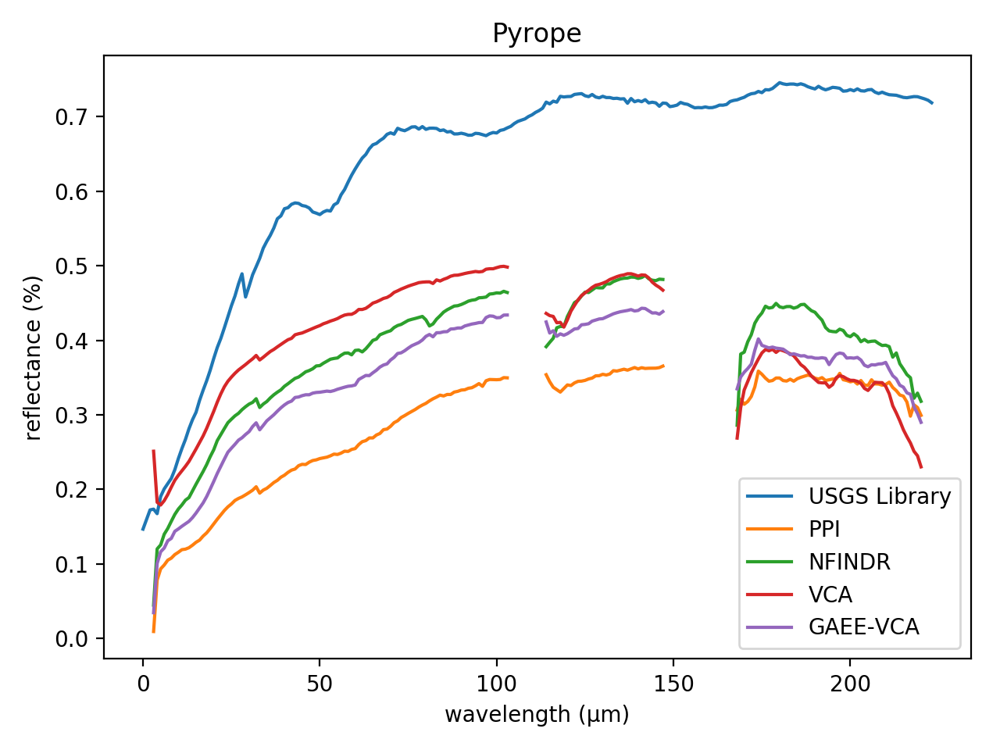
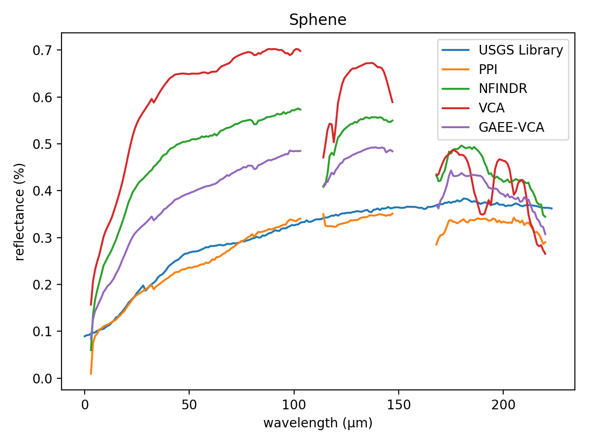
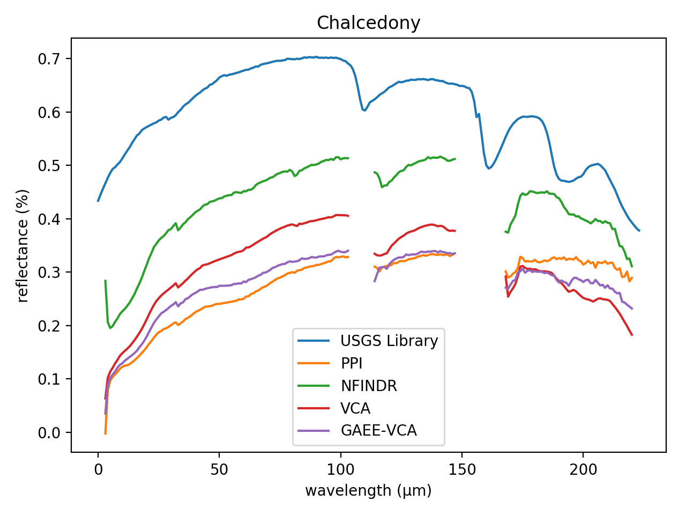

# Comparison of Vertex Componet Analysis (VCA) and Genetic Algorithm Endmember Extraction (GAEE) algorithms for Endmember Extraction

## Douglas Winston R. S., Gustavo T. Laureano, Celso G. Camilo Jr.

Endmember Extraction is a critical step in hyperspectral image analysis and classification. It is an useful method to decompose a mixed spectrum into a collection of spectra and their corresponding proportions. In this paper, we solve a linear endmember extraction problem as an evolutionary optimization task, maximizing the Simplex Volume in the endmember space. We propose a standard genetic algorithm and a variation with In Vitro Fertilization module (IVFm) to find the best solutions and compare the results with the state-of-art Vertex Component Analysis (VCA) method and the traditional algorithms Pixel Purity Index (PPI) and N-FINDR. The experimental results on real and synthetic hyperspectral data confirms the overcome in performance and accuracy of the proposed approaches over the mentioned algorithms.

**Envirionment Setup:**

Monte Carlo runs: 2 

Number of endmembers to estimate: 12 

Number of skewers (PPI): 1 

Maximum number of iterations (N-FINDR): 1 

### Parameters used in each GAEE versions

| Parameters            |   GAEE |   GAEE-IVFm |   GAEE-VCA |   GAEE-IVFm-VCA |
|:----------------------|-------:|------------:|-----------:|----------------:|
| Population Size       |   10   |        10   |       10   |            10   |
| Number of Generations |   10   |        10   |       10   |            10   |
| Crossover Probability |    1   |         1   |        1   |             1   |
| Mutation Probability  |    0.3 |         0.3 |        0.3 |             0.3 |

### Comparison between the ground-truth Laboratory Reflectances and extracted endmembers using PPI, N-FINDR, VCA, GAEE, GAEE-IVFm using SAM for the Cuprite Dataset.

| Endmembers       |       PPI |    NFINDR |       VCA |      GAEE |   GAEE-IVFm |   GAEE-VCA |   GAEE-IVFm-VCA |
|:-----------------|----------:|----------:|----------:|----------:|------------:|-----------:|----------------:|
| Alunite          | 0.3743766 | **0.0926312** | 0.1016300 | 0.2547822 |   0.3221124 |  0.1042759 |       0.1042759 |
| Andradite        | 0.0757956 | 0.0724709 | 0.0825015 | 0.0754090 |   0.0745913 |  **0.0711488** |       0.0791944 |
| Buddingtonite    | 0.2080900 | 0.0761604 | 0.0785924 | 0.1376028 |   0.1109898 |  **0.0761598** |       **0.0761598** |
| Dumortierite     | 0.1907338 | 0.0720035 | 0.0701844 | 0.0958019 |   **0.0652051** |  0.0754879 |       0.0754879 |
| Kaolinite_1      | **0.0794624** | 0.0870056 | 0.1597324 | 0.1111559 |   0.0825960 |  0.0870058 |       0.0870058 |
| Kaolinite_2      | 0.0819634 | 0.0889228 | 0.0643954 | **0.0505907** |   0.0811214 |  0.0980162 |       0.0641441 |
| Muscovite        | 0.2506333 | **0.1091060** | 0.1102735 | 0.1932890 |   0.1977319 |  0.1733430 |       0.1472549 |
| Montmonrillonite | 0.1338156 | 0.0648080 | 0.0697852 | 0.0652345 |   **0.0600326** |  0.0747908 |       0.0646271 |
| Nontronite       | 0.1032919 | 0.0758386 | 0.1025926 | **0.0703223** |   0.0862359 |  0.0803941 |       0.0910179 |
| Pyrope           | 0.0578827 | 0.1221578 | 0.1608928 | 0.0641821 |   **0.0566601** |  0.0892564 |       0.0607906 |
| Sphene           | 0.0673117 | 0.2856719 | 0.0834347 | **0.0669595** |   0.0782894 |  0.1345759 |       0.2856719 |
| Chalcedony       | 0.0871248 | 0.0871248 | 0.0877934 | 0.1650664 |   0.0827149 |  **0.0765022** |       **0.0765022** |

### SAM Statistics for Cuprite Dataset. 

| Statistics   |         PPI |     NFINDR |       VCA |       GAEE |   GAEE-IVFm |   GAEE-VCA |   GAEE-IVFm-VCA |
|:-------------|------------:|-----------:|----------:|-----------:|------------:|-----------:|----------------:|
| _Mean_       |   0.1425401 |  0.1059427 | **0.1004192** |  0.1158070 |   0.1103518 |  0.1008518 |       0.1023890 |
| _Std_        |   **0.0000000** |  0.0085976 | 0.0124712 |  0.0086350 |   0.0055699 |  0.0122254 |       0.0024359 |
| _p-value_    | -15.2144165 | -1.3247770 | 0.0000000 | -3.5889098 |  -2.8278017 | **-0.0675774** |      -0.6369726 |
| _Time_       |   0.2487271 |  3.8647314 | 0.6868065 |  0.2505833 |   0.2305547 |  **0.2248574** |       0.2289623 |

### Comparison between the ground-truth Laboratory Reflectances and extracted endmembers using PPI, N-FINDR, VCA, GAEE, GAEE-IVFm using SID for the Cuprite Dataset.

| Endmembers       |       PPI |    NFINDR |       VCA |      GAEE |   GAEE-IVFm |   GAEE-VCA |   GAEE-IVFm-VCA |
|:-----------------|----------:|----------:|----------:|----------:|------------:|-----------:|----------------:|
| Alunite          | **0.0000000** | **0.0000000** | 0.0132672 | **0.0000000** |   **0.0000000** |  0.0145061 |       0.0145061 |
| Andradite        | **0.0000000** | 0.0061679 | 0.0093155 | **0.0000000** |   0.0084489 |  0.0065357 |       0.0070744 |
| Buddingtonite    | 0.0476680 | **0.0071905** | 0.0076571 | 0.0214349 |   0.0405461 |  **0.0071905** |       **0.0071905** |
| Dumortierite     | 0.0562235 | **0.0068965** | 0.0069423 | 0.0115398 |   0.0085717 |  0.0077469 |       0.0077469 |
| Kaolinite_1      | 0.0113668 | 0.0130991 | 0.0176589 | **0.0101783** |   0.0112691 |  0.0130991 |       0.0130991 |
| Kaolinite_2      | 0.0113963 | 0.0109124 | **0.0053574** | 0.0081648 |   0.0061102 |  0.0109716 |       0.0058072 |
| Muscovite        | 0.0969470 | 0.0316990 | **0.0145920** | 0.0496366 |   0.0672291 |  0.0418133 |       0.0257197 |
| Montmonrillonite | 0.0229949 | 0.0048775 | 0.0058785 | 0.0050964 |   0.0072514 |  0.0074408 |       **0.0047043** |
| Nontronite       | 0.0126400 | 0.0076655 | 0.0132864 | **0.0071509** |   0.0084877 |  0.0098968 |       0.0099081 |
| Pyrope           | 0.0071348 | 0.0530846 | 0.0624350 | 0.0101344 |   **0.0059217** |  0.0086078 |       0.0065019 |
| Sphene           | **0.0075691** | 0.0912113 | 0.0095759 | 0.0225699 |   0.0134802 |  0.0206732 |       0.0912113 |
| Chalcedony       | 0.0088268 | 0.0088268 | 0.0090267 | 0.0356810 |   0.0187101 |  **0.0070255** |       **0.0070255** |

### SID Statistics for Cuprite Dataset. 

| Statistics   |        PPI |     NFINDR |       VCA |      GAEE |   GAEE-IVFm |   GAEE-VCA |   GAEE-IVFm-VCA |
|:-------------|-----------:|-----------:|----------:|----------:|------------:|-----------:|----------------:|
| _Mean_       |  0.0235639 |  0.0226774 | 0.0186399 | 0.0172989 |   0.0209613 |  **0.0135549** |       0.0168744 |
| _Std_        |  **0.0000000** |  0.0032907 | 0.0076888 | 0.0028678 |   0.0079770 |  0.0015586 |       0.0003593 |
| _p-value_    | -1.2136675 | -0.8433593 | 0.0000000 | 0.2915512 |  **-0.3772895** |  1.2400448 |       0.4347892 |
| _Time_       |  0.2487271 |  3.8647314 | 0.6868065 | 0.2505833 |   0.2305547 |  **0.2248574** |       0.2289623 |

