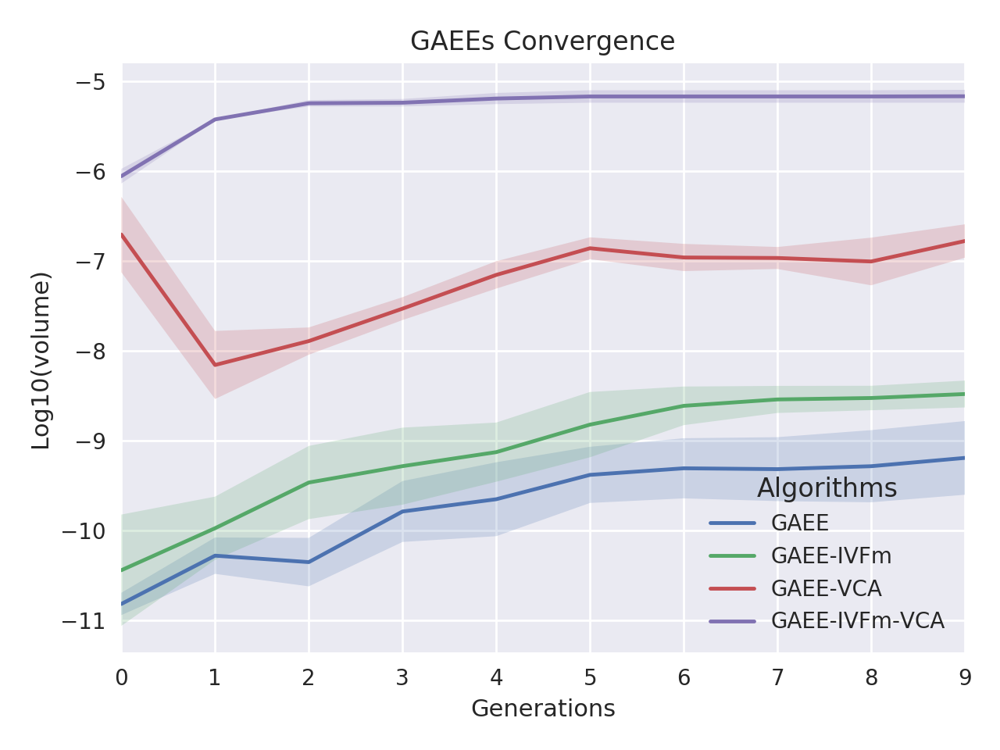

# Comparison of Vertex Componet Analysis (VCA) and Genetic Algorithm Endmember Extraction (GAEE) algorithms for Endmember Extraction

## Douglas Winston R. S., Gustavo T. Laureano, Celso G. Camilo Jr.

Endmember Extraction is a critical step in hyperspectral image analysis and classification. It is an useful method to decompose a mixed spectrum into a collection of spectra and their corresponding proportions. In this paper, we solve a linear endmember extraction problem as an evolutionary optimization task, maximizing the Simplex Volume in the endmember space. We propose a standard genetic algorithm and a variation with In Vitro Fertilization module (IVFm) to find the best solutions and compare the results with the state-of-art Vertex Component Analysis (VCA) method and the traditional algorithms Pixel Purity Index (PPI) and N-FINDR. The experimental results on real and synthetic hyperspectral data confirms the overcome in performance and accuracy of the proposed approaches over the mentioned algorithms.

**Envirionment Setup:**

Monte Carlo runs: 2 

Number of endmembers to estimate: 12 

Number of skewers (PPI): 5 

Maximum number of iterations (N-FINDR): 5 

  
### Parameters used in each GAEE versions

| Parameters            |   GAEE |   GAEE-IVFm |   GAEE-VCA |   GAEE-IVFm-VCA |
|:----------------------|-------:|------------:|-----------:|----------------:|
| Population Size       |   10   |        10   |       10   |            10   |
| Number of Generations |   10   |        10   |       10   |            10   |
| Crossover Probability |    1   |         1   |        1   |             1   |
| Mutation Probability  |    0.3 |         0.3 |        0.3 |             0.3 |

### Comparison between the ground-truth Laboratory Reflectances and extracted endmembers using PPI, N-FINDR, VCA, GAEE, GAEE-IVFm using SAM for the Cuprite Dataset.

| Endmembers       |       PPI |    NFINDR |       VCA |      GAEE |   GAEE-IVFm |   GAEE-VCA |   GAEE-IVFm-VCA |
|:-----------------|----------:|----------:|----------:|----------:|------------:|-----------:|----------------:|
| Alunite          | 0.3743766 | 0.1033697 | **0.1024622** | 0.2304829 |   0.2966748 |  0.1432868 |       0.2520140 |
| Andradite        | 0.0757956 | 0.0724709 | 0.0777159 | **0.0721898** |   0.0741043 |  0.0762279 |       0.0831497 |
| Buddingtonite    | 0.2080900 | **0.0761604** | 0.0785924 | 0.1335343 |   0.1239247 |  0.1495861 |       0.1112950 |
| Dumortierite     | 0.1907338 | 0.0720035 | **0.0701844** | 0.0848325 |   0.0887306 |  0.0949668 |       0.0949668 |
| Kaolinite_1      | **0.0794624** | 0.0870056 | 0.0862021 | 0.1010141 |   0.0843374 |  0.0821066 |       0.0870058 |
| Kaolinite_2      | 0.0819634 | 0.0889228 | 0.0758247 | **0.0600040** |   0.0630163 |  0.0681440 |       0.0806440 |
| Muscovite        | 0.2506333 | **0.1091060** | 0.1385263 | 0.1586018 |   0.1650054 |  0.1923375 |       0.1766049 |
| Montmonrillonite | 0.1338156 | 0.0648080 | 0.0678531 | 0.0747498 |   0.0660982 |  0.0657460 |       **0.0622239** |
| Nontronite       | 0.1032919 | **0.0758386** | 0.0771623 | 0.0871644 |   0.0800942 |  0.0801300 |       0.0773569 |
| Pyrope           | 0.0578827 | 0.1221578 | 0.1840727 | 0.0690517 |   0.0718116 |  0.0643961 |       **0.0546785** |
| Sphene           | 0.0673117 | 0.2856719 | 0.0645219 | 0.1172313 |   0.1561811 |  0.1339748 |       **0.0602528** |
| Chalcedony       | 0.0871248 | 0.0871248 | 0.0760768 | 0.0975795 |   **0.0705055** |  0.0752052 |       0.0752052 |

### SAM Statistics for Cuprite Dataset. 

| Statistics   |        PPI |     NFINDR |       VCA |       GAEE |   GAEE-IVFm |   GAEE-VCA |   GAEE-IVFm-VCA |
|:-------------|-----------:|-----------:|----------:|-----------:|------------:|-----------:|----------------:|
| _Mean_       |  0.1425401 |  0.1057002 | **0.0976979** |  0.1092116 |   0.1147005 |  0.1044568 |       0.1039115 |
| _Std_        |  **0.0000000** |  0.0053321 | 0.0068459 |  0.0100262 |   0.0087876 |  0.0118019 |       0.0051337 |
| _p-value_    | -7.3531637 | -1.2480515 | 0.0000000 | -1.7932317 |  -2.5027878 | -1.0380624 |      **-0.9356854** |
| _Time_       |  0.2720207 |  9.4011933 | 0.6682736 |  0.2396158 |   0.2245959 |  **0.2210222** |       0.2299354 |

### Comparison between the ground-truth Laboratory Reflectances and extracted endmembers using PPI, N-FINDR, VCA, GAEE, GAEE-IVFm using SID for the Cuprite Dataset.

| Endmembers       |       PPI |    NFINDR |       VCA |      GAEE |   GAEE-IVFm |   GAEE-VCA |   GAEE-IVFm-VCA |
|:-----------------|----------:|----------:|----------:|----------:|------------:|-----------:|----------------:|
| Alunite          | **0.0000000** | **0.0000000** | 0.0140103 | **0.0000000** |   **0.0000000** |  **0.0000000** |       **0.0000000** |
| Andradite        | **0.0000000** | 0.0061679 | 0.0203901 | **0.0000000** |   **0.0000000** |  0.0073622 |       0.0080131 |
| Buddingtonite    | 0.0476680 | 0.0071905 | 0.0132472 | 0.0223084 |   **0.0000000** |  0.0283777 |       0.0150719 |
| Dumortierite     | 0.0562235 | **0.0068965** | 0.0071826 | 0.0122427 |   0.0170544 |  0.0122132 |       0.0122132 |
| Kaolinite_1      | 0.0113668 | 0.0130991 | 0.0129241 | 0.0116847 |   0.0120978 |  **0.0109179** |       0.0130991 |
| Kaolinite_2      | 0.0113963 | 0.0109124 | **0.0057029** | 0.0059180 |   0.0059628 |  0.0069229 |       0.0082711 |
| Muscovite        | 0.0969470 | **0.0300733** | 0.0307502 | 0.0569103 |   0.0365937 |  0.0305958 |       0.0420025 |
| Montmonrillonite | 0.0229949 | 0.0048775 | **0.0047469** | 0.0053644 |   0.0054478 |  0.0055524 |       0.0052453 |
| Nontronite       | 0.0126400 | 0.0076655 | 0.0111129 | 0.0079341 |   **0.0071900** |  0.0097618 |       0.0076978 |
| Pyrope           | 0.0071348 | 0.0530846 | 0.0624350 | 0.0116773 |   0.0064424 |  0.0095254 |       **0.0049771** |
| Sphene           | 0.0075691 | 0.0912113 | 0.0079718 | **0.0070089** |   0.0159529 |  0.0764072 |       0.0550325 |
| Chalcedony       | 0.0088268 | 0.0088268 | 0.0069070 | 0.0399347 |   0.0361536 |  **0.0066897** |       **0.0066897** |

### SID Statistics for Cuprite Dataset. 

| Statistics   |        PPI |     NFINDR |       VCA |      GAEE |   GAEE-IVFm |   GAEE-VCA |   GAEE-IVFm-VCA |
|:-------------|-----------:|-----------:|----------:|----------:|------------:|-----------:|----------------:|
| _Mean_       |  0.0235639 |  0.0221020 | 0.0202657 | 0.0151192 |   **0.0131337** |  0.0179421 |       0.0152296 |
| _Std_        |  **0.0000000** |  0.0024464 | 0.0091012 | 0.0022428 |   0.0044518 |  0.0022753 |       0.0006832 |
| _p-value_    | -0.8640130 | **-0.4213994** | 0.0000000 | 1.3481550 |   1.7788824 |  0.5919305 |       1.3131335 |
| _Time_       |  0.2720207 |  9.4011933 | 0.6682736 | 0.2396158 |   0.2245959 |  **0.2210222** |       0.2299354 |

